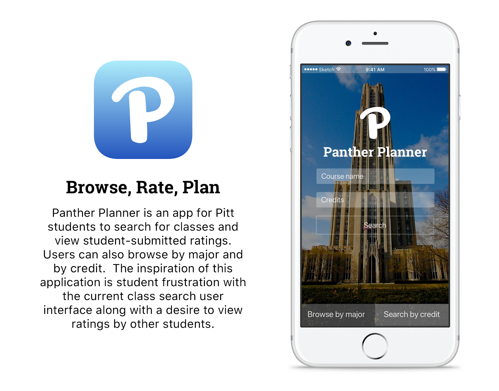
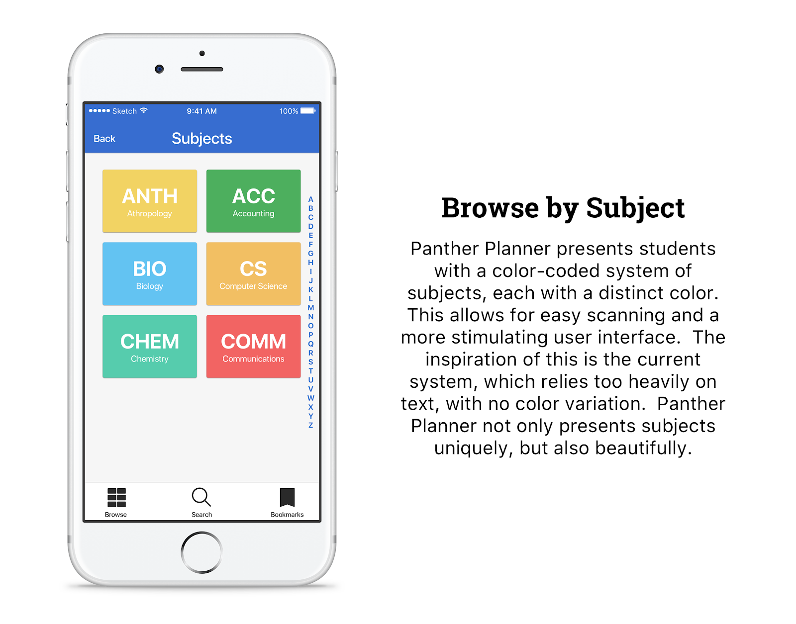
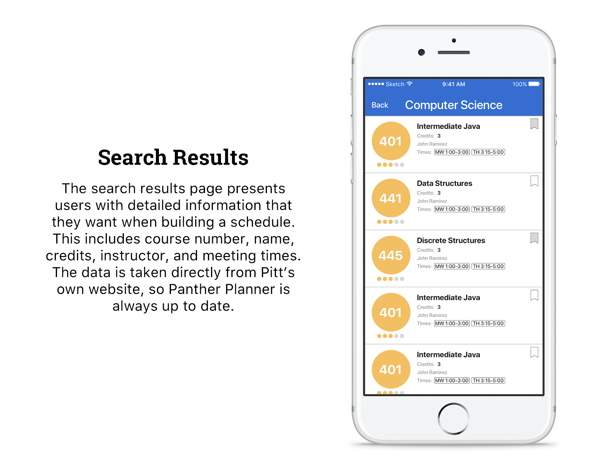
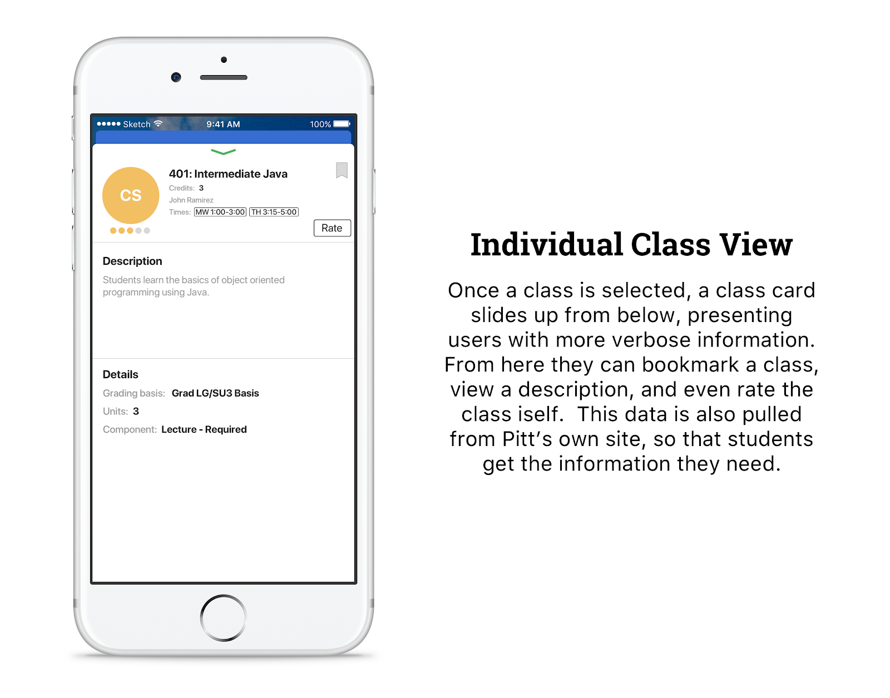

# Panther Planner

This was an iOS app prototype built for the Mobile App Challenge at the University of Pittsburgh. All app designs were built in *Sketch for Mac*.

## Overview
The primary purpose of the application was to provide a way for Pitt students to browse and enroll in classes in a manner much more accessible than the current platform. The current course enrollment process is old and outdated, thus Panther Planner was born! Enrolling and search for classes used to be dull and boring, now it is fun and engaging for all of its users.

## Screenshots

  
 

 
 

  
 

 
 

  
 

 
 

  
 

